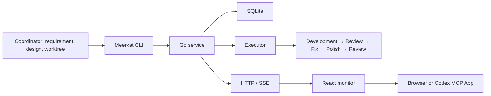

# Meerkat

Local agent delivery for Git projects. A coordinator defines the task and prepares a linked worktree. Meerkat runs development, review, bounded fixes, polish and final review, then records local delivery and actual usage.

Meerkat is a general tool. Projects supply their own requirements, private profiles and repository paths. The first executor is Pi; the scheduler depends on a generic Executor interface.

## Architecture

| Layer | Technology |
| --- | --- |
| Scheduler, state machine, CLI and local service | Go 1.26, standard library |
| State, history, metrics and receipts | SQLite, modernc.org/sqlite, WAL and foreign keys |
| Agents / Tasks / Usage | React 19, TypeScript 7, Vite 8 |
| Live updates | HTTP snapshot and SSE |
| Coordinator commands | Private Unix socket |
| Execution | Executor interface → Pi CLI → configured provider |
| Codex display | MCP Apps `open_monitor` (standard host adapter); optional legacy CDP adapter |



## Concepts

| Term | Meaning |
| --- | --- |
| Project | A registered Git repository and its private profiles. |
| Task | One bounded goal, explicit paths, acceptance checks, dependencies and budget. |
| Operation | A durable dispatch receipt for selected tasks; completion records their outcomes, not code acceptance. |
| Context | Curated decisions and source references, frozen by version and digest. It is not a shared chat transcript. |
| Role | developer, reviewer or polisher; fixes are developer runs. |
| Profile | Executor, provider, model, credential environment-variable name and limits. |
| Agent | A reusable local execution slot, such as Agent-01. |
| Session | Private execution history bound to a task, role and frozen profile. |
| Run | One execution segment of a role, with its frozen profile and actual usage; persistent executors bind it to a Session. |
| Delivery | Candidate SHA and checks after final review. |
| Controller | Deterministic Go scheduler owning the lease and execution processes. |

Delivered means a locally AI-reviewed commit. Human effect checks, independent QA, GitHub integration and deployment remain separate decisions.

## Install (end users)

Version `0.4.0-beta.4` is a release candidate. Install from the GitHub marketplace and source now; tag-based binary downloads await publication. macOS/Linux on arm64/amd64; Windows is unsupported. Source setup needs Node 22, Git, Go 1.26+, Codex and Pi 0.99.1. Bundled frontend assets do not need rebuilding.

```sh
codex plugin marketplace add hunknownz/Meerkat --ref main
codex plugin add meerkat@meerkat
git clone https://github.com/hunknownz/Meerkat.git
cd Meerkat
node scripts/build-release.mjs
node scripts/setup.mjs --artifact-dir .dist/releases/0.4.0-beta.4
node scripts/configure.mjs --project-id example --provider PROVIDER --model MODEL --auth-env MY_PROVIDER_KEY
export MY_PROVIDER_KEY=...        # in your own shell only
node scripts/launch.mjs serve --port 47826
```

Then, in a new Codex chat, ask `打开 Meerkat 面板` (MCP Apps tool `open_monitor`). Full guide, diagnosis, update and uninstall: [docs/install.md](docs/install.md). Distribution: [docs/publishing.md](docs/publishing.md).

## Run tasks

The default private data directory is ~/.meerkat/. Use the same --data-dir for all commands when selecting another directory. Keep credentials in the environment inherited by the service; profiles contain references only. `launch.mjs` runs the installed binary and never builds or downloads.

```sh
node scripts/launch.mjs prepare --input /private/task.json
node scripts/launch.mjs execute --task <task-id>
node scripts/launch.mjs snapshot
node scripts/launch.mjs stop --run <run-id> --request-id <uuid>
node scripts/launch.mjs execute --task <task-id> --resume
```

See [task input](skills/workflow/references/task-input.md). The monitor displays active agents, tasks, deliveries and usage. The browser can request a stop and change future-run settings; it cannot start tasks. Codex display is read-only.

The development branch also supports immediate `dispatch` receipts and bounded `operation` queries through CLI and MCP. All submissions share one durable queue. See [asynchronous dispatch](docs/async-dispatch.md) for request IDs, lost-reply recovery, restart behavior and current limits. The installed release has not been replaced by this development work.

Scheduler-driven Pi runs use [persistent sessions](docs/persistent-sessions.md) through private RPC. Development/fixes reuse verified task history; every review starts independently. [Request budget authorization](docs/request-budgets.md) reserves allowance before supported Pi HTTP requests and settles raw usage. [Stage reserves and early wrap-up](docs/stage-budgets.md) retain later-role allowance and request bounded completion. Recovery of uncommitted changes remains pending. The current bridge supports Pi 0.99.1 text HTTP SSE with `openai-completions` only.

Single delegation runs only the developer and records a first local candidate, unreviewed:

```sh
node scripts/launch.mjs run --input /private/task.json --dry-run
node scripts/launch.mjs run --input /private/task.json
```

The examples below write `bin/meerkat` for brevity; `node scripts/launch.mjs` accepts the same commands.

## Issue integration

Issues are optional task sources and discussion records. Reading one does not turn its text into an instruction or authorization.

```sh
bin/meerkat issue read --url https://github.com/owner/repo/issues/1 --output /private/issue.json
bin/meerkat issue update --task <task-id>
bin/meerkat issue update --task <task-id> --apply
```

The update command first creates a local draft. --apply sends it only with corresponding user authorization. A delivery marker and durable receipt prevent blind repeat posting after an unknown result.

## Budgets, recovery and history

Each task shares its token, time and fix-round budget across roles. Cache reads and writes count toward the token cap. Missing usage and cost remain unknown. Distinct worktrees can run concurrently, while one worktree is exclusive.

After a crash, unverified runs become unknown. The service neither replays them nor signals an old PID. Explicit recovery requires checking the process and worktree first, then --resume --acknowledge-interruption. Changed SHA, scope, Context or Profile requires investigation or a new task.

Migration imports records by original ID and source digest. Invalid or conflicting data blocks switching. Old tasks without a frozen contract stay historical and cannot execute. Backups are consistent SQLite snapshots; restoration uses a separate directory so newer records are preserved.

```sh
bin/meerkat migrate --from /private/legacy --run-root /private/archived-run-root
bin/meerkat backup --output /private/history.db
bin/meerkat restore --backup /private/history.db --to /private/fresh-data-dir
bin/meerkat export --format json --output /private/metrics.json
```

Backups include prepared Issue bodies and restore their paths into the new private directory. When moving the same logical project to another repository, `migrate --project-moves /private/moves.json` accepts explicit `{projectId, fromRepositories, toRepositories}` mappings. Both source and existing destination must match. The target project stays intact; the original project and mapping remain in the private import audit. Plain migration still rejects divergent records.

Development-branch backups also include idle/unknown session history files; backups with running sessions are refused. See [session storage and recovery](docs/persistent-sessions.md).

Metrics include Project, Task, Run, Role, Executor, Model and available change IDs, tokens, queue time, execution time and fix rounds. Provider model time, test time and fees stay null unless measured. JSON and CSV exports contain no context, credentials or transcript.

## Codex plugin

The plugin supplies the skills `meerkat:get-started`, `meerkat:delegate` and `meerkat:workflow`, plus a local stdio MCP server whose MCP Apps tool `open_monitor` opens a read-only monitor (global or per-thread entrypoint). The real Codex MCP Apps panel was [verified on 2026-10-03](docs/codex-ui-acceptance.md), including Agents / Tasks / Usage and disabled writes. Hosts without MCP Apps use `snapshot`. The legacy CDP adapter is optional and not used by default, see [desktop adapter](desktop/README.md); it does not modify the Codex application bundle.

## Development and evidence

Contributors need Go 1.26 and the frontend toolchain (`cd frontend && npm ci`). `node scripts/build.mjs` builds `bin/meerkat`; `node scripts/build-release.mjs` builds release binaries from a `git archive` of clean HEAD.

```sh
go test -race ./...
go vet ./...
cd frontend
npm run check
npm test
npm run build
```

[Migration design](design/architecture-go-sqlite-react-20261002.md) · [Delivery verification](design/verification-0.3.0.md).

License: [MIT](LICENSE), © 2026 hunknownz.
