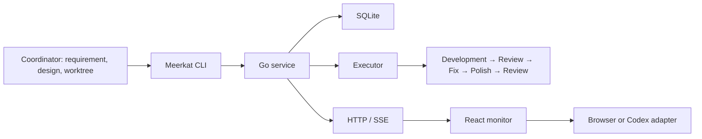

# Meerkat

Local agent delivery for Git projects. A coordinator defines the task and prepares a linked worktree. Meerkat runs development, review, bounded fixes, polish and final review, then records local delivery and actual usage.

Meerkat is a general tool. Projects supply their own requirements, private profiles and repository paths. The first executor is Pi; the scheduler depends on a generic Executor interface.

## Architecture

| Layer | Technology |
| --- | --- |
| Scheduler, state machine, CLI and local service | Go 1.26, standard library |
| State, history, metrics and receipts | SQLite, modernc.org/sqlite, WAL and foreign keys |
| Agents / Tasks / Usage | React 19, TypeScript 7, Vite 8 |
| Live updates | HTTP snapshot and SSE |
| Coordinator commands | Private Unix socket |
| Execution | Executor interface → Pi CLI → configured provider |
| Codex display | Experimental thin CDP adapter, shared React mount in ShadowRoot |



## Concepts

| Term | Meaning |
| --- | --- |
| Project | A registered Git repository and its private profiles. |
| Task | One bounded goal, explicit paths, acceptance checks, dependencies and budget. |
| Context | Curated decisions and source references, frozen by version and digest. It is not a shared chat transcript. |
| Role | developer, reviewer or polisher; fixes are developer runs. |
| Profile | Executor, provider, model, credential environment-variable name and limits. |
| Agent | A reusable local execution slot, such as Agent-01. |
| Run | One invocation of one role with its frozen profile and actual usage. |
| Delivery | Candidate SHA and checks after final review. |
| Controller | Deterministic Go scheduler owning the lease and execution processes. |

Delivered means a locally AI-reviewed commit. Human effect checks, independent QA, GitHub integration and deployment remain separate decisions.

## Build and run

Requires Go 1.26, Node 22, Git, and Pi for Pi execution. gh is used only for Issue integration.

```sh
nvm use
cd frontend
npm ci
cd ..
node scripts/build.mjs
bin/meerkat serve --port 47826
```

The default private data directory is ~/.meerkat/. Use the same --data-dir for all commands when selecting another directory. Keep credentials in the environment inherited by the service; profiles contain references only.

```sh
bin/meerkat prepare --input /private/task.json
bin/meerkat execute --task <task-id>
bin/meerkat snapshot
bin/meerkat stop --run <run-id> --request-id <uuid>
bin/meerkat execute --task <task-id> --resume
```

See [task input](skills/workflow/references/task-input.md). The monitor displays active agents, tasks, deliveries and usage. The browser can request a stop and change future-run settings; it cannot start tasks. Codex display is read-only and removes the browser write token from its bridge.

## Single delegation

```sh
bin/meerkat run --input /private/task.json --dry-run
bin/meerkat run --input /private/task.json
```

This runs only the developer and records a local candidate. The coordinator reviews it. It does not mark the task as AI-reviewed delivery. The old Node entry points now forward to Go; legacy freeform run flags were replaced by the same strict task input.

## Issue integration

Issues are optional task sources and discussion records. Reading one does not turn its text into an instruction or authorization.

```sh
bin/meerkat issue read --url https://github.com/owner/repo/issues/1 --output /private/issue.json
bin/meerkat issue update --task <task-id>
bin/meerkat issue update --task <task-id> --apply
```

The update command first creates a local draft. --apply sends it only with corresponding user authorization. A delivery marker and durable receipt prevent blind repeat posting after an unknown result.

## Budgets, recovery and history

Each task shares its token, time and fix-round budget across roles. Cache reads and writes count toward the token cap. Missing usage and cost remain unknown. Distinct worktrees can run concurrently, while one worktree is exclusive.

After a crash, unverified runs become unknown. The service neither replays them nor signals an old PID. Explicit recovery requires checking the process and worktree first, then --resume --acknowledge-interruption. Changed SHA, scope, Context or Profile requires investigation or a new task.

Migration imports records by original ID and source digest. Invalid or conflicting data blocks switching. Old tasks without a frozen contract stay historical and cannot execute. Backups are consistent SQLite snapshots; restoration uses a separate directory so newer records are preserved.

## Codex plugin

```sh
node scripts/package.mjs
codex plugin marketplace add /path/to/Meerkat
codex plugin add meerkat@meerkat
```

Package from a clean committed tree after installing frontend dependencies. The marketplace installs the staged package at `.dist/meerkat`, including the Go binary and `build-info.json` with source and binary hashes. Repackaging keeps the prior stage for recovery. `--skip-build` uses an existing binary and should only be used when its source is already verified.

The plugin supplies meerkat:delegate and meerkat:workflow. The custom sidebar monitor is an experimental CDP integration, separate from official skill installation. See [desktop adapter](desktop/README.md). It does not modify the Codex application bundle.

## Development and evidence

```sh
go test -race ./...
go vet ./...
cd frontend
npm run check
npm test
npm run build
```

[Migration design](design/architecture-go-sqlite-react-20261002.md) · [Delivery verification](design/verification-0.3.0.md).
