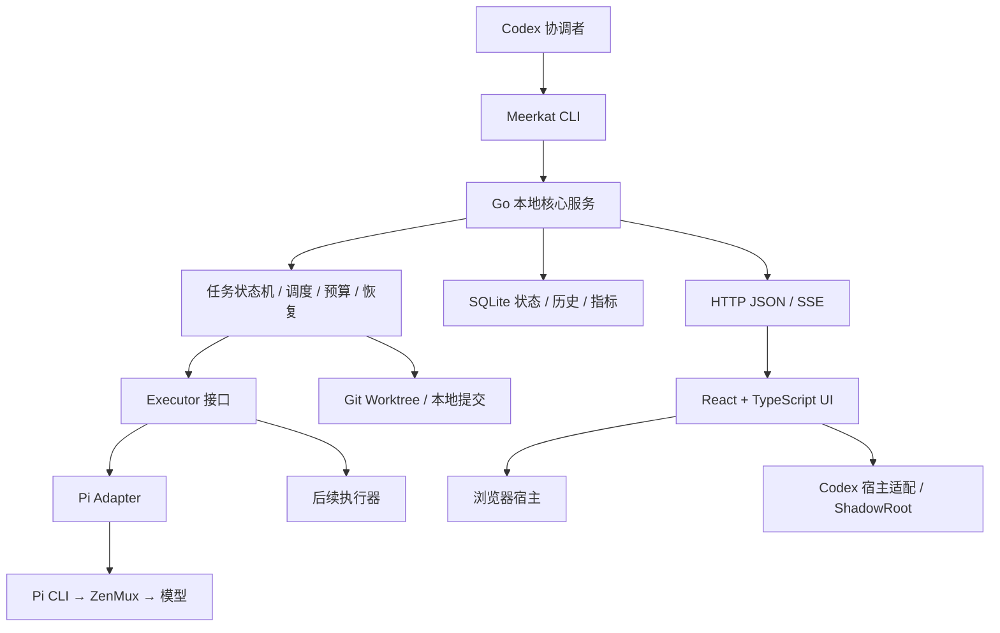

# Meerkat 技术栈与迁移方案

日期：2026-10-02（Asia/Shanghai）

change_id：`meerkat-architecture-20261002`

源码基线：`99791e08d5f470ce55835aa6046965390c3cabee`

状态：架构方案；运行代码尚未迁移。

用户明确选择 Go 后端及 React + TypeScript 前端。本方案建议同时采用 SQLite，并抽出执行器接口。Meerkat 是通用项目工具，不绑定具体使用项目。

## 1. 结论与原因

| 部分 | 当前实现 | 目标实现 | 原因 |
| --- | --- | --- | --- |
| 调度 / 后端 / CLI | Node.js 脚本 | 一个 Go 核心及 CLI / 本地服务入口 | 进程生命周期、调度与服务复用，便于打包交付 |
| 状态与历史 | JSON 文件、文件锁、心跳、原子替换 | SQLite、事务、约束、索引与调度器租约 | 任务、运行、审查、版本和指标已经有持久关系 |
| 前端 | 原生 HTML/CSS/JS DOM 工厂 | React + TypeScript + Vite | 复用组件与明确数据类型，减少字符串拼接和状态同步代码 |
| 执行协议 | `scripts/run.mjs` 直接解析 Pi 事件 | 通用 Executor 接口，首个实现 Pi | 将任务编排与具体执行器分离 |
| 界面通信 | HTTP JSON、4 秒轮询 | 保持快照 API；增加 SSE 更新 | 保留完整快照恢复能力，及时展示已提交状态 |
| Codex 展示 | CDP + ShadowRoot 实验适配 | 薄宿主适配层，挂载同一 React 组件 | 展示方式与业务核心分开；迁移技术栈不会自动解决宿主入口 |

最初 JSON 适合验证一次委派。当前 `workflow/store.mjs` 已自行实现状态替换、租约、心跳和停止请求回执；`workflow/core.mjs` 维护任务、运行、交付、审查与用量关系。SQLite 能减少这部分持久化维护，但不能自动解决外部进程恢复或重复执行。

Go 不直接减少模型 token 或模型等待时间。效率优化仍来自上下文裁剪、减少重复阅读、准确的任务拆分、适度的审查轮次，以及用指标定位瓶颈。

## 2. Magpie 源码核对

本轮读取上游源码提交 `4afb69863849b44fa5983a483e36baeb29cd3f39`。

| 核对结果 | 证据 | 对 Meerkat 的选择 |
| --- | --- | --- |
| Go 核心，桌面使用 Wails v3 | [go.mod](https://github.com/yetone/magpie/blob/4afb69863849b44fa5983a483e36baeb29cd3f39/go.mod)、[gui/app.go](https://github.com/yetone/magpie/blob/4afb69863849b44fa5983a483e36baeb29cd3f39/internal/gui/app.go) | 借鉴核心复用；独立桌面壳暂不纳入迁移 |
| 页面通过 JSON API 与 Go 通信；静态资源用 `go:embed` 嵌入 | [gui/api.go](https://github.com/yetone/magpie/blob/4afb69863849b44fa5983a483e36baeb29cd3f39/internal/gui/api.go) | Go 服务嵌入前端构建产物，多宿主使用同一界面与服务合同 |
| 桌面与浏览器复用页面和后端 Handler | [gui/web.go](https://github.com/yetone/magpie/blob/4afb69863849b44fa5983a483e36baeb29cd3f39/internal/gui/web.go) | React 页面只依赖 Transport，不直接耦合 Codex 或特定地址 |
| 当前前端是原生 HTML/JavaScript，没有 React 构建流程 | [gui/assets/app.js](https://github.com/yetone/magpie/blob/4afb69863849b44fa5983a483e36baeb29cd3f39/internal/gui/assets/app.js)、[README](https://github.com/yetone/magpie/blob/4afb69863849b44fa5983a483e36baeb29cd3f39/README.md) | 视觉与信息结构继续借鉴；Meerkat 按用户选择使用 React/TS |
| 有 `modernc.org/sqlite` 依赖，但自己的用量记录写入 `usage.jsonl` | [usage/usage.go](https://github.com/yetone/magpie/blob/4afb69863849b44fa5983a483e36baeb29cd3f39/internal/usage/usage.go)、[sessions/cursor.go](https://github.com/yetone/magpie/blob/4afb69863849b44fa5983a483e36baeb29cd3f39/internal/sessions/cursor.go) | SQLite 由 Meerkat 的事务、历史和查询需求决定 |

采用核心复用、薄界面宿主、嵌入静态资源、结构化用量归属。Meerkat 继续负责任务交付编排；模型网关由现有 ZenMux 等服务提供。

## 3. 目标架构

一个本地服务拥有调度器及执行进程。CLI、HTTP 层调用同一业务核心；界面负责展示及已支持的停止请求、未来运行设置。启动任务仍由协调者发起。服务入口需要区分协调者命令权限与界面权限，浏览器会话不持有启动执行的凭据。

Go 核心建议先用标准库 `net/http`、`os/exec`、`context`、`database/sql` 和 `embed`。SQLite 优先评估纯 Go 的 `modernc.org/sqlite`，锁定实施时验证通过的版本。当前机器已有 Go 1.26.0；本轮没有升级工具链。

Node 在前端构建和当前 Pi CLI 执行时仍然需要。CDP 适配脚本可以暂时保留为薄连接器，其内部不再承担调度或业务存储。

## 4. SQLite 合同

默认数据目录建议使用通用的 `~/.meerkat/`，支持 `--data-dir`。仓库内的配置可继续使用 JSON；任务权威状态进入 SQLite；较大的附件及必要的私有报告留在文件系统，由数据库记录路径与摘要。

核心数据包含 projects、contexts（不可变版本）、profiles（冻结快照）、tasks、runs、run_events、deliveries、reviews、usage，以及 Issue 更新回执。Task 依赖、调度器租约和 Worktree 占用通过关系与约束表达；Schema 使用版本化迁移。

- 本地数据库启用 WAL、外键和忙等待超时，使用短事务与串行写入。SQL 事务内部不等待模型、Git 或网络请求。
- 状态变更与相关运行记录在同一事务内提交；前端只接收提交后的快照和事件。
- 启动进程前记录执行意图，启动后记录身份及心跳。崩溃恢复核实进程和 Worktree；不自动重放未知运行，不仅凭旧 PID 发送信号。
- 单个 Worktree 同时只允许一个活动任务占用；同一数据目录保留单一调度器租约。
- 数据库及附件目录保留私有权限；数据库仅保存凭据引用，不保存 API key。
- `usage` 保留 input、output、cacheRead、cacheWrite 的独立计数、完整度和来源。未知 token、费用或模型实际返回信息保持空值；Go/TS 类型也必须表达空值。
- 备份使用 SQLite 一致性备份机制；运行中不能只复制主 `.db` 而遗漏 WAL。恢复须验证 Schema 和关键关系。

SQLite WAL 仍只有一个同时写入者，需要本机文件系统。后续跨机器 Agent 通过服务接口报送事件；不共享网络盘上的数据库文件。[SQLite 使用场景](https://sqlite.org/whentouse.html)、[WAL](https://sqlite.org/wal.html)、[备份 API](https://sqlite.org/backup.html)。

## 5. 执行器接口与指标

`Executor` 的最小职责是：校验可用性、启动一次 Run、转换结构化事件及用量、停止己方进程、返回规范化结果和角色报告。其输入是冻结 Context、Role、Profile、范围、Worktree、候选 SHA 及剩余预算；编排核心不读取 Pi 专有事件。

Profile 新增明确的 `executor` 选择。旧 `piCommand` 仅在 Pi Adapter 内兼容；模型、服务商及凭据引用保持各执行器可验证的配置。首个实施版本只实现 Pi；其他执行器以独立 Adapter 接入。

保留开发 → 审查 → 有限修复 → 精修 → 复审。Codex 准备 Worktree。审查绑定精确 SHA 和 Context digest；`delivered` 只表示经过本地 AI 审查的提交。

指标按 Project / change_id / Task / Run / Role / Executor / Model 关联，保存开始与结束、排队时间、模型执行耗时、可测的测试耗时、修复轮次、用量、费用来源和已知缺口。墙钟耗时与 Agent 耗时合计分开。提供 SQL 查询和 JSON/CSV 导出，便于持续比较流程；不采集完整聊天记录。

## 6. React / TS 与 Codex 宿主

保留 Agents / Tasks / Usage 三个简洁视图及已有 Magpie 风格。用组件替换字符串模板；共享 `MeerkatUI` 只接受强类型数据和 Transport。任务、运行、审查、用量采用一份版本化 API 合同，生成 TS 类型，并对真实 JSON 做运行时校验。

浏览器 Transport 使用 HTTP 快照、SSE、受保护的停止与设置请求；Codex Transport 由薄适配层转交快照，保持现有只读能力。SSE 断连可从完整快照恢复，并显示未知/过期状态。

Vite 生成本地静态资源及适合注入的自包含挂载入口。React 在 ShadowRoot 内部的容器挂载，样式局部化。通过可信本地适配层传递数据，无需在 Codex 页面内加载外部 CDN。

Go、React 或 Wails 都不会自动产生 Codex 原生插件入口。当前 CDP 适配仍受客户端版本影响，本次源码版本的原生验证尚未完成；迁移验收必须单列该项。将来需要独立桌面应用时，再评估 Wails 复用同一 Go 核心和 React 页面。

## 7. 迁移顺序与完成条件

1. **冻结现有行为及 API 合同。** 保留当前 126 项测试作为行为清单，先选择实际关键链路迁移，避免照搬仅检查文案的测试。
2. **Go + SQLite + Pi 的完整链路。** 在隔离目录实现一次任务的准备、开发、审查、精修、复审、交付，并验证停止、重启、预算与精确版本绑定。现有 Node 环境继续可用。
3. **React/TS 界面。** 接上真实 Go 快照；验证活跃数量、历史、未知用量、断连、停止回执和能力差异，然后增加 SSE 实时更新。
4. **历史导入与恢复。** 从旧 JSON、已注册运行回执和 Issue 回执只读导入；用来源摘要保证幂等，对账 ID、关系、SHA、时间和用量。保留原文件及恢复方法；新旧核心不能同时写同一组任务。
5. **切换与实践。** 更新 Skill/CLI、版本化安装包和宿主适配，先做一个受控的真实 Pi 任务，再用于实际项目的有界开发任务。停止旧 owner 后切换。核对后才能淘汰旧实现。

完成必须证明：角色流程、同 Worktree 排他、跨任务并发、停止及未知进程恢复、Issue 更新幂等、精确 SHA/digest、用量未知语义、导入对账和 React 实际页面都通过。原生 Codex 验证、插件安装状态、远端写入与项目上线各自记录。

## 8. 主要一手来源

- Magpie 上述冻结提交的 Go 核心、GUI API、Web 宿主和用量源码。
- [Go 数据库访问](https://go.dev/doc/tutorial/database-access)、[os/exec](https://pkg.go.dev/os/exec)、[embed](https://pkg.go.dev/embed)。
- [modernc.org/sqlite](https://pkg.go.dev/modernc.org/sqlite)、SQLite 使用场景 / WAL / 备份文档。
- [React TypeScript](https://react.dev/learn/typescript)、[Vite 后端集成](https://vite.dev/guide/backend-integration)。
