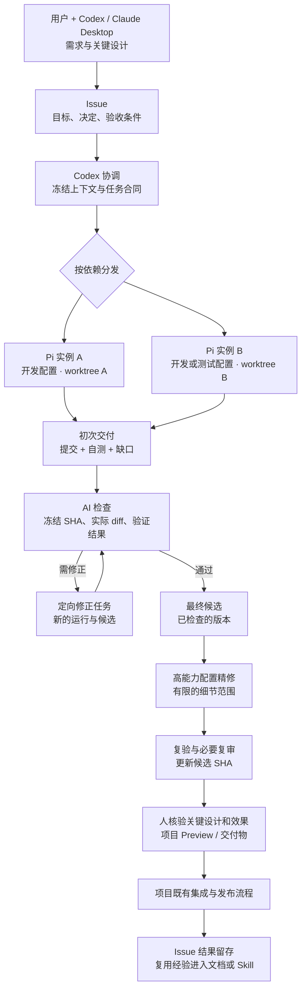
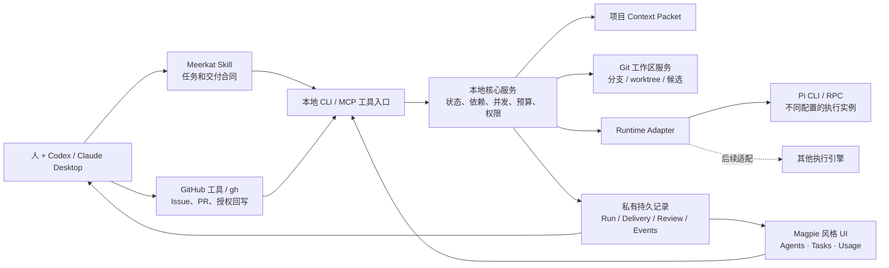

# Meerkat 完整设计方案

版本：v1.0 / 2026-10-02
状态：完整设计候选；配套交互原型。实际后台接入能力见第 15 节，不将原型状态当作已实现能力。
Owner：用户与 Codex 负责目标、设计和取舍；Pi 负责代码实施；Meerkat 保存执行事实并展示。

## 1. 目标与使用方式

Meerkat 是一个通用的本地 Agent 开发协作插件：把明确任务分发给使用不同模型的 Agent，保留共同的项目背景，接收初次交付，检查与修正，形成最终候选，再由用户配置的高能力模型做细节精修并复验。

用户主要在 Codex 或 Claude Desktop 中讨论需求、架构和重要设计。Meerkat 页面用于看执行情况和结果，发起受控操作。Pi 是当前代码开发引擎；其他 Agent 引擎通过适配器加入。example-project 是首个实践项目，插件内不固化客户规则、部署拓扑、素材、密钥或仓库名称。

一次典型使用：

> “做 Issue #142。前端和测试可以分开，开发使用成本较低的配置，检查使用审查配置，最后使用精修配置。先给我 Preview 看效果。”

Codex 把这句话变成确定的任务合同和分工。用户在页面看到两个实例分别在做什么、共享上下文版本、当前候选和是否需要自己的判断。技术审查交给 AI；人核验关键设计和可见结果。

### 成功标准

- 用户在 5 秒内看懂运行数量、各实例的任务与当前动作。
- 可以回查谁用哪个模型做过哪些任务、交付了什么、检查发现什么、精修改变什么。
- 同一任务在 Issue、上下文、代码、检查、运行用量和最终候选之间能追踪。
- 所有运行都有明确停止条件；中断与未知状态得到准确表达。
- 代码集成、Preview、生产发布、内容发布和客户接受保留各自状态与项目规则。
- 项目、模型或执行引擎更换时，核心流程仍可使用。

## 2. 统一概念

| 概念 | 定义 | 身份与示例 |
|---|---|---|
| Project 项目 | 一组工作目标、代码仓库及项目规则 | 稳定 projectId；example-project、Meerkat |
| Repository 仓库 | 一个独立的 Git 根与远端身份 | host/owner/repo + 本地根；一个项目可包含 Website 与 CMS |
| Issue | 人与 Agent 对需求、讨论、决定、验收的长期记录 | 完整 URL，含主机、owner、repo、number |
| Task 任务 | 可独立实施和验证的工作合同 | taskId；目标、范围、验收、依赖、目标仓库、上下文版本 |
| Agent 实例 | 可复用的逻辑工作实例；每次 Run 启动独立进程，PID 不能代替 Agent 身份 | agentId + runtime + 当前 role；Pi-01、Pi-02 |
| Role 角色 | 此次执行承担的责任 | coordinator、developer、reviewer、polisher |
| Model Profile 模型配置 | 执行引擎、provider/model、预算与必要参数 | development、review、polish；模型名称不等于 Agent 身份 |
| Run 执行 | 某实例针对某任务的一次尝试 | runId；同一任务可有多次执行 |
| Context 上下文 | 被确认、带版本、不可静默改写的任务背景 | contextId/version/digest，例如 CTX-142 v3 |
| Delivery 交付 | 可核验的代码或报告产物 | deliveryId、基线/候选 SHA、文件、检查与缺口 |
| Candidate 候选 | 当前等待审查、精修、集成或效果核验的冻结版本 | 一个仓库 SHA；跨仓库为一组明确 SHA 与项目配置/内容引用 |

Issue 不是 Agent 身份；GitHub assignee 也不能代表一个临时 Pi 进程。不同模型可以由相同 Pi 引擎启动成不同实例。页面上的“2 个运行中”只统计 Meerkat 能管理并核实的实例；外部 Codex/Claude 会话单独显示为协调入口，不能伪造实时状态。

## 3. 工作流程与责任



“最终候选”指主体开发和检查完成；精修如果修改代码，会形成一个新候选。对外交付展示的是精修复验后的版本。UI 将“最终交付”和“Preview 已部署”“生产已发布”“客户已接受”分开显示。

| 环节 | 执行者 | 必须留下的事实 |
|---|---|---|
| 需求与重要设计 | 用户、Codex / Claude Desktop | 确认范围与待决事项 |
| 任务分解与分发 | 当前协调者 Codex | taskId、仓库、依赖、所选配置、上下文版本 |
| 工作区准备 | Codex / Meerkat 工作区服务 | 基线 SHA、分支、worktree、所有者与清理条件 |
| 实施与自测 | Pi 开发实例 | 本地提交、具体检查、缺口、真实用量 |
| 技术检查 | Codex 或专用审查实例 | 对候选 SHA 的结论、证据与可行动发现 |
| 定向修正 | Pi 开发实例 | 发现编号、新候选、修正检查 |
| 精修 | Pi 的 polish 配置；其他引擎须先接适配器 | 明确的细节范围、变化与复验 |
| 效果与关键设计核验 | 人，配合可见结果与项目规则 | 接受、退回或仍需资料 |
| 集成、发布 | 项目授权的协调/运维入口 | PR、CI、Preview、发布回执及回滚依据 |

完整设计支持并行；并行运行仍各有独立任务合同。可以一次完成整个功能，但不让多个实例对同一份可写目录无序修改。

## 4. Issue 的工作方式

### 4.1 Issue 承载什么

Issue 保存用户结果、范围、关键设计决定、验收条件、采用的上下文版本、交付摘要以及 PR/Preview/发布引用。GitHub 现成的任务列表和子 Issue 可表达需要独立讨论的工作项；不为每次工具调用建立 Issue。[GitHub 官方任务组织说明](https://docs.github.com/en/issues/tracking-your-work-with-issues/learning-about-issues/planning-and-tracking-work-for-your-team-or-project)

简单变更可以一个 Issue 对应一个 Task；完整功能一个 Issue 对应多个 Task，各 Task 绑定实际目标仓库和依赖。Issue 所属仓库与代码仓库可以不同。关闭条件写在 Issue 中：内部插件修复可按交付合同完成，客户网站需求则遵守项目规定的效果/客户验收状态。

### 4.2 从 Issue 到执行

1. 协调者通过 GitHub 工具或 `gh issue view` 读取标题、正文、更新时间及所需讨论；该 CLI 支持 JSON 字段和完整 Issue URL。[GitHub CLI 官方说明](https://cli.github.com/manual/gh_issue_view)
2. 协调者解决冲突，写出可执行合同；外部正文与评论作为来源资料，不能覆盖工具权限或系统指令。
3. 保存读取时刻、来源引用及采用内容的摘要指纹。每个 Task 固定其 contextVersion。
4. 开始、阻塞、交付时形成短摘要；普通工具事件留在本地，避免 Issue 评论持续刷屏。
5. GitHub 写操作由拥有用户授权的协调者执行。Pi 仅交付本地产物，runner 不自行评论、关闭 Issue、push 或合并。
6. 回写失败保留本地 delivery 与 pending 状态；以 issueUrl + deliveryId 做幂等检查，不重跑开发，不重复评论。

### 4.3 Issue 模板

```markdown
## 目标
用户希望得到什么可观察结果？
## 本次范围与关键决定
已确认范围、接口约束、仍需人判断的事项。
## 验收
可核验的行为与环境。
## 执行与交付
Task / contextVersion / candidate；初次交付、检查、精修与复验摘要。
## 结果
提交、PR、Preview、发布状态；已知缺口与关闭依据。
## 经验
问题原因与处理；可复用文档/Skill 链接。
```

Issue 留下本次经验；稳定的工作规则从中提炼到项目文档或 Skill。敏感的客户资料、运行对话和凭据不复制到通用插件或公开 Issue。

## 5. 共享上下文

共享意味着使用相同的已确认背景、接口与决定，不要求所有实例接收彼此完整的对话。

一个 Context Packet 包含：

- Goal：确认的用户结果与验收。
- Decisions：已确定的关键设计与禁止擅改的约束。
- Contracts：仓库关系、接口、测试及交付约定。
- Sources：必要文件/证据引用与摘要指纹。
- Baseline：目标仓库/代码候选及环境引用。
- Delta：与前一个版本的变化及原因。

每个 Task 使用 `公共 Context Packet + 此任务必要文件与范围`。审查接收合同、候选 diff 和检查回执；精修接收通过的候选、细节清单和界面证据，不从零重读全部历史。摘要需要能回到原始来源。

### 更新规则

Context v3 发给开发与审查后保持固定。实例发现问题时返回 finding/proposal，协调者决定是否形成 v4。影响合同的变更会使相关未完成任务和旧审查结论失效；UI 明示需要更新或复验。非相关任务可继续，不强制全体重启。

Context Packet 属于项目私有数据；跨项目复用的是插件能力和经提炼的通用经验。共享文件系统、Git worktree 和摘要都不是安全沙箱。

## 6. 分发、模型与工作区

### 6.1 可解释的分发

先按目标仓库、写入范围和依赖判断任务是否可并行；再按角色指定模型配置。默认本地并发 2，用户可修改。预算与依赖不允许时保持排队并显示原因。

- 独立组件或独立测试目录可以并行。
- 两个任务改变相同接口、锁文件或共享 schema 时，先冻结合同、串行执行，或安排独立集成任务。
- 每个可写 Run 有独立 worktree 与分支；协调者决定基线和整合顺序。
- 后续任务只在前置提交与合同满足后启动；不能只凭 Agent 的“完成”文本放行。

### 6.2 模型配置

| 配置 | 用途 | 选择原则 |
|---|---|---|
| development | 明确范围的实施和定向修正 | 先使用符合任务要求且成本可控的配置 |
| review | 检查合同、风险、diff 与验证证据 | 独立视角，不使用开发者自我评价代替检查 |
| polish | 已通过主体检查后的有限精修 | 用户指定的高能力配置，不按价格推断能力 |

用户讨论中提出的 Flash、Opus 为候选配置名称；实际 modelId/provider 以本机可用配置与一次核对结果为准。UI 原型的名称是配置示例，不声称可用性或价格。运行中切换配置不会偷偷换模型；新配置用于新的 Run，旧 Run 保留原始配置快照。

最终精修是完整流程的一环：检查交互、视觉细节、命名、可维护性和任务明确要求。没有可改善之处时允许返回“无需改动”的报告。禁止通过大范围重写制造工作量；改变需求或关键设计时回到协调者与人。

### 6.3 一台机器与多个项目

每台机器一个本地服务管理它启动的进程。同一项目可有多个 Git 仓库，多个项目可以共存；项目根、配置、上下文和运行记录按 projectId 分隔。先使用本机的 Pi 适配器。

远程机器可通过后续 Worker Adapter 接入：需要独立鉴权、任务包交付、工作区管理、产物回传和退出确认。这是同一数据合同的扩展，不在本次原型中模拟成真实可用远程执行。

## 7. 初次交付、检查与精修合同

### 7.1 初次交付

开发 Run 成功需满足：正常退出、Agent 明确结束、基线的后续提交、任务分支未被换掉、工作树干净、声明的检查完成。Delivery 包含 candidateSha、changedPaths、checks、knownGaps、contextVersion 和 runId。

这些条件证明开发者交付了一个可审查版本，不自行推导需求全部验收或线上已更新。

### 7.2 检查

检查围绕冻结 SHA 和合同进行：可观察验收是否满足、回归、权限/数据/外部副作用、测试覆盖以及范围外修改。发现记录为 `id / severity / evidence / affectedFile / requestedFix`。

检查 Run 的成功合同与开发不同：正常结束、有效报告、检查候选与输入一致、无非预期代码修改。可以合法“没有新提交”。当前 runner 的开发成功条件要求新提交，因此不能直接把它当作通用审查 runner。

Codex 宿主审查可先用 report ingestion 登记真实结论。专用 Pi 审查模式需要新增 role/output 合同与受约束工作区；`read,bash` 不能保证只读，必须检查工作树变化并说明隔离能力。

### 7.3 修正和终止

定向修正关联发现编号并生成新候选；重新运行受影响检查与必要回归。默认最多 2 轮自动修正，达到上限、预算不足、规格冲突或新风险时进入 needs_input/blocked，显示原因与下一步。开发子任务的冲突整合也留下独立记录。

### 7.4 最终精修与复验

主体检查通过 → 冻结候选 → polish 配置按细节清单精修 → 有变化则提交新 SHA → 自测、必要复审 → 输出最终 Delivery。精修没有改动时输出有效 no-change 报告并保留原候选，不因没有提交误报失败。

人检查最终渲染效果和关键设计。涉及 UI 的任务链接本地/项目 Preview；涉及纯脚本的任务提供输入输出与检查证据。项目风险要求独立 QA 时，补充独立 QA 结论；Meerkat 不把一般 AI review 自动称为独立 QA。

## 8. UI 总体结构：参照 Magpie

用户已指定质感、UI 与详细结构模仿 Magpie。参考固定为 Magpie `47741ee31f2f66c365661e37ffd2cb7af53773e5`，读取过 `internal/gui/assets/app.css`、`index.html` 和官方面板截图。[Magpie 源码](https://github.com/yetone/magpie/tree/47741ee31f2f66c365661e37ffd2cb7af53773e5/internal/gui/assets)、[官方面板截图](https://usemagpie.ai/img/panel-light.png)

采用其浅灰底/深色对应色、原生系统字体、紧凑分组列表、细分隔线、小型弹出选择器、顶部切换栏与展开详情方式；品牌与业务信息使用 Meerkat。复制的 MIT 代码/样式保留上游许可证声明。

### 页面骨架

```text
Meerkat             [ Agents | Tasks | Usage ]        主题  设置
项目选择             2 个运行中 · 1 个等待             状态更新时间

正在运行
  Pi-01 · 开发    搜索结果空状态      Flash      正在验证边界输入
  Pi-02 · 精修    移动菜单间距        Opus       正在复验 390px 布局

最近交付
  Issue #142      初次交付            修复空状态；等待检查
  Issue #137      精修后待核验        调整间距；复验已完成

底部：本地服务状态与简短提示
```

这张示意的数据是样例。真实界面的运行数量来源于服务观测结果；不显示猜测的完成百分比、ETA 或未经报告的费用。

### 8.1 Agents：默认首页

顶部只保留项目范围、运行数、等待/需要处理数和更新时间。每个实例行固定信息顺序：

1. 实例 + 角色，例如 Pi-01 · 开发。
2. 当前任务的自然语言标题，优先于 UUID 或文件名。
3. 项目、目标仓库与来源 Issue。
4. 当前模型配置、流程阶段、耗时。
5. 最近观察到的动作及时间；例如“本地测试刚结束”，不推测“正在思考”。

行展开后显示近 3 个结构化事件、worktree、上下文版本和最近交付。下面显示近期交付摘要，点击打开 Task 详情。外部协调者作为入口单独显示，不混入本地活跃进程计数。

### 8.2 Tasks：做过什么

一个搜索框和 `全部 / 进行中 / 已交付 / 需处理` 过滤器；行展示标题、Issue、当前阶段、执行者与最新结果。排序优先需要处理与进行中，然后按最近更新时间。

任务详情用抽屉/Sheet 展开：

- 概览：目标、验收、依赖、阻塞与下一步。
- 流程：任务、开发、初次交付、检查、最终候选、精修复验的实际事件。
- 共享上下文：当前与采用版本、必要来源、发给哪些实例、变更记录。
- 交付与检查：基线/候选、改了什么、具体检查、发现与修正、精修前后。
- 运行记录：每次实例、模型、耗时、用量完整性与结果。

初次交付、最终代码交付和项目发布分别表达。用户不需要在这里逐行审阅 diff，可以按需打开来源、报告、PR 或 Preview。

### 8.3 Usage：是否有效率

以小型汇总条和分组行显示。可按项目、任务、角色、模型和时间筛选。默认摘要包括已报告 token、缓存使用、费用可用性、Agent 总耗时、实际经过时间、返工次数与等待检查时间。详细口径见第 12 节。

费用为未知时显示“未返回/未知”；部分用量给已知小计与缺失计数。原型中的样例数值始终带“示例”提示。

### 8.4 设置与操作

设置通过小型 Sheet 展示项目范围、角色配置、并发上限、修正轮数与预算。模型选择器沿用 Magpie 的小尺寸弹出样式；只对以后执行生效。

真实 UI 的操作包括：停止具体 Run、为失败 Run 准备新的重试、查看 Issue、查看候选、打开项目 Preview。停止会产生 stopping → stopped 状态；重试创建新 runId，保留上一回执与修改。写入类按钮通过服务验证当前状态和项目授权；双击或重复请求用 requestId 幂等处理。

本次交互原型展示视图切换、项目与任务筛选、详情、共享上下文、检查记录、设置与模拟异常。原型中任何操作都必须清楚是本地模拟，不能伪装为实际进程控制。

### 8.5 状态与窄面板

| 情况 | 展示 |
|---|---|
| 正常 | 当前观测数量、更新时间与实例行 |
| 无活跃执行 | 0 个运行中；近期交付仍可看 |
| 服务断连 | 运行状态未知；最后已知数据标明过期 |
| 心跳过期/退出未回执 | 实例“状态待核对”，由服务检查，不推导成功 |
| 预算停止 | 原因、已知用量、保留的工作区及下一动作 |
| 初次交付待检查 | 候选已收到，检查尚未完成 |
| 检查失败 | 发现摘要和待修正任务 |
| 精修完成 | 显示复验结论及最终候选；人仍可核验效果 |

600px 以下保持同一信息结构，控制项换行，详情覆盖面板；390px 不产生水平页面滚动。深浅色主题沿用原生风格；键盘可切换与关闭详情，焦点回到触发元素，减少动画设置有效。主任务标题约 14–15px，基本文字约 13–14px。

## 9. 技术架构与 Codex 集成



### 组件边界

| 组件 | 负责 | 关键约束 |
|---|---|---|
| Coordinator Skill | 任务准备、分发依据、审查与结果交接 | 模型作判断；实际控制通过可验证工具执行 |
| Core Service | 任务/执行状态、依赖、并发与持久回执 | 确定性状态转移；每个资源有稳定 ID |
| Runtime Adapter | 启动、观察、停止与收集执行输出 | 第一种实现 Pi；不绑定单个模型 |
| Git Service | 注册仓库、核对基线、准备工作区和产物 | 受控参数；拒绝覆盖脏目录或错误仓库 |
| Context Store | 私有版本化任务背景和来源 | 版本不可静默变更；项目隔离 |
| Result Store | 运行、交付、检查、用量与事件 | 脱离 worktree 生命周期；无完整对话 |
| GitHub Adapter / Coordinator Tool | 读取 Issue、回写阶段摘要、链接结果 | 复用现有认证与授权，外部回写幂等 |
| UI Adapter | 同一个 UI 资源与宿主外观/容器连接 | UI 不自行执行 shell 或处理 provider 密钥 |

### 本机接口

统一的概念操作为 `prepare_task / start_run / get_state / stop_run / record_review / list_deliveries / prepare_issue_update`。这些是拟议接口名称，当前不声称已提供 MCP tools。CLI 和 MCP 复用核心服务，UI 使用同一结构化状态 API。

本地服务监听 loopback；修改操作有同源/会话校验、受控仓库与路径、输入上限和 idempotency key。服务端只启动已注册 runtime 和允许的参数，不能把 UI 输入拼成任意 shell 命令。密钥由环境或现有私有 auth store 提供；配置只引用凭据名称。

### Codex UI 的当前边界

官方插件可以组合 Skill 和 MCP。官方的 UI 与 Sidebar Extensions 文档描述 ChatGPT 的组件呈现，官方排障页也明确 UI 相关行为属于 ChatGPT；这些资料不能证明当前 Codex desktop 支持同样的原生侧边栏入口。[官方插件架构](https://developers.openai.com/plugins/concepts/plugins)、[官方扩展说明](https://developers.openai.com/plugins/build/extensions)、[官方排障说明](https://developers.openai.com/plugins/deploy/troubleshooting)

当前 Meerkat 左侧入口使用本机非官方 desktop 适配器，依赖显式启用的调试端点和版本相关 UI 结构。设计将业务数据、UI 资源、宿主适配器分开：可以沿用现有适配方式，也能在确认官方 Codex UI 扩展接口后更换宿主层。UI 原型可单独检查；原型打开不等于已经接入 Codex 原生侧边栏。当前受工具限制未重新视觉核验 Codex 原生窗口，不通过其他渠道绕过该限制。

## 10. Pi 适配器与执行合同

第一版实现可以继续使用当前受控 CLI 子进程。需要持续交互、停止确认和状态请求时，可评估 Pi RPC；先核对本机安装版本，不因上游变动盲目升级。[Pi 官方 RPC 文档](https://github.com/earendil-works/pi/blob/main/packages/coding-agent/docs/rpc.md)、[Pi 官方 SDK 文档](https://github.com/earendil-works/pi/blob/main/packages/coding-agent/docs/sdk.md)

拟议接口：

```text
Adapter.start(taskContract, contextPacket, modelProfile, workspace) -> runId
Adapter.observe(runId) -> observedEvents
Adapter.stop(runId, reason) -> stopping / stopped / unknown
Adapter.collect(runId) -> roleSpecificResult + usageCompleteness
```

roleSpecificResult 不同：

- developer：范围化代码提交 + checks + knownGaps。
- reviewer：引用候选 SHA 的检查报告 + findings；通常无新代码提交。
- polisher：新代码提交或明确 no-change 报告 + checks；都需形成有效结果。

先观测执行实例，再关联任务阶段。缓存、模型与工具事件均取实际输出；观察到读取文件只能显示“读取文件”，不能宣称完整上下文已理解。能力不可用时返回具体缺口，不伪造成功。

## 11. 数据、状态与恢复

### 11.1 持久目录

第一版使用现有 Node 22 与私有 JSON 存储，集中在本机 dataDir：

```text
dataDir/
  projects/<projectId>/project.json
  tasks/<taskId>/contract.json
  contexts/<contextId>/<version>.json
  runs/<runId>/summary.json
  runs/<runId>/events.jsonl
  deliveries/<deliveryId>.json
  reviews/<reviewId>.json
  pending-issue-updates/<deliveryId>.json
```

目录 0700、文件 0600；校验 ID 与路径，原子写入。由核心服务串行管理权威状态，子进程只提交事件，避免多个实例并发修改同一个总表。每个 Run 的事件流有序号和时间，partial line 不当成完整事件。日志设置大小与留存上限。

当前 worktree 内摘要保留兼容副本；集中副本为查询权威源。导入旧数据按 schemaVersion 标明 provenance，缺失字段保持未知，不推断旧 Issue 或旧费用。数据增长或多人共享确有需要时再迁移 SQLite，保留同一读写合同。

### 11.2 最小对象字段

```text
Task: id, projectId, issueRef?, targetRepository, title, goal, scope,
      acceptance, dependencies[], contextRef, selectedProfiles, state
Run: id, taskId, agentId, role, runtime, modelSnapshot, contextRef,
     repository, workspace, baselineSha, state, timestamps, usage, resultRef
Delivery: id, runIds[], candidateManifest, changedPaths, checks,
          knownGaps, reviewRefs[], polishRef?, publishedSurfaces[]
Review: id, candidateManifestDigest, contextRef, reviewerRunId?,
        source, verdict, findings[], evidenceRefs[]
Event: id, runId, seq, observedAt, type, safeSummary
```

candidateManifest 表达多个仓库的精确 SHA 及项目所需的内容/配置引用；不把两个仓库的某个单一 SHA 当成整个联合功能。Review 必须能核对它签的候选与合同。

### 11.3 状态机

Run：`prepared → queued → running → stopping → stopped` 或 `running → succeeded / failed`；无法核实退出时为 `unknown`，不能直接当 failed 后自动重跑。

Task：`draft → ready → implementing → first_delivery → checking → final_candidate → polishing → rechecking → delivered`。随时可以明确进入 `blocked / needs_input / cancelled`。是否已集成、Preview、已发布、客户接受在项目 Delivery Surface 中另存；按任务完成合同判断是否 delivered 与 Issue 关闭。

Task 有依赖时的 queued 原因写明是依赖、并发还是预算。修改上下文、候选或验收会使相关阶段失效，留下 delta。界面从权威状态投影，不靠按钮文字猜测进度。

### 11.4 恢复与终止

- 本地服务重启后核查进程、心跳与产物；PID 需结合进程标记/启动时间，防止 PID 复用误判。
- 有终态摘要即可恢复交付；进程退出但无终态时保留 unknown/interrupted 和工作区，协调者核查。
- 停止作用于特定 Run；确认退出前不能释放其写工作区或启动相同任务的替代执行。
- 失败和预算停止保留实际修改；下一次执行前先检查工作树与候选，不覆盖。
- 只有提交可达、必要私有回执已集中保存、无活跃进程、无唯一产物时才清理 worktree。
- GitHub API 故障只阻塞同步；不丢开发结果，不重新调用模型来修复网络。

## 12. 成本、时间与质量指标

每个 Task 和 Run 都携带同一 change_id 或可追踪映射。界面默认摘要，明细可导出 JSON/CSV，不复制原始对话。

| 指标 | 口径 |
|---|---|
| 实际经过时间 | 需求/任务 ready 到指定交付状态；明确起止与等待 |
| Agent 总耗时 | 各 Run elapsed 之和；并行时不能当作经过时间 |
| 阶段等待 | 等依赖、等检查、等人核验、等发布分别记录 |
| 已报告 token | provider 报告 input/output/cacheRead/cacheWrite，保留不同类别 |
| 用量完整性 | complete / partial / unknown；缺失与非法值不能转成 0 |
| 费用 | reported 实付、按已知价格 estimated、unknown 分开；价格注明来源与时间 |
| 首次交付通过率 | 无定向修正即通过主体检查的任务 / 完成主体检查的任务 |
| 返工 | 检查发现引发的修正 Run 与原因；常规开发工具轮次不算返工 |
| 精修效果 | 解决了哪些具体发现、增加多少 token/时间、是否造成新回归 |
| 无效执行 | 无有效产物、重复工作、错误基线、无依据重试的次数和原因 |
| Preview 延迟 | 项目允许记录时，合并到真实可见 Preview 的时间与精确候选 |

预算分别设并发、maxWallSeconds、已报告 token、已知费用、修正轮数。Run 可能在下一次用量返回前超出 token 估算；token 上限不是供应商收费的绝对上限。费用不可知时仍靠时间/调用次数等已有约束停止，不能保证金额硬封顶。

省成本的具体方法：稳定 Context Packet、任务仅加必要文件、检查只看冻结合同与证据、精修范围有限、固定角色配置、无默认跨模型重试。缓存是否命中以返回计数为准；不能因传相同文本就承诺不同 provider/模型共享缓存。

## 13. 与 example-project 工作流的连接

通用插件读取项目自己的命令、角色 Skill、验收和发布合同；example-project 配置留在项目内。一个网站/CMS 联合 Issue 可拆为 Website Task、CMS Task 与联合验证 Task，统一上下文合同，分别登记 SHA 和内容/配置引用。

在 example-project：本地实施与快速检查 → AI 审查 → 获授权的 PR/合并 → main 自动 Preview 与精确 SHA 回执 → 人尽早看效果 → 按风险补独立 QA → 单独选定生产候选与授权发布。CMS 内容发布遵守对应的草稿/预览/发布链，不能把代码已合并当成内容已上线。

Meerkat 首页可显示“等待 Preview 核验”等来源明确的阶段；它不承担部署引擎，使用项目现有工具报告结果。GitHub 免费模式下，Pi 和主要本地检查在本机执行；服务状态轮询只读本地数据，不消耗 GitHub Actions runner。

## 14. 一次性交付的实施清单

完整方案按下面依赖组织实施，最终验收覆盖整条链。每个 Pi coding task 有确定范围与本地提交，完整功能统一整合交付，不把内部模块当作用户需求的替代品。

1. **数据与执行基础**：Task/Context/Run/Delivery/Review 合同、Issue 来源与持久回执、精确未知用量、恢复与停止状态。
2. **角色执行与分发**：Pi developer/reviewer/polisher 的不同成功合同、依赖/写入范围、并发/预算限制、无改动精修报告、候选失效机制。
3. **Issue 与协调工具**：既有 GitHub 工具适配、来源快照、交付摘要、幂等回写、Codex 审查报告登记、必要 CLI/MCP 入口。
4. **完整 UI 接入**：Agents/Tasks/Usage、详情与设置、真实状态和回执、受控停止/重试；页面从原型切换到服务 API。
5. **宿主与项目验证**：Codex 适配器版本核对与人工可见验收、example-project 真实 Issue 验证、使用说明与完整交付记录。

### 整条链的验收场景

- 一个真实 Issue 创建两项无冲突任务，各在正确仓库/工作区按所选模型运行，共享同一版本背景。
- 首页运行数量、阶段与事件来自真实进程和服务记录；外部协调会话没有冒充本地实例。
- 初次交付的提交可核对；一次检查发现能转为定向修正，重查的是新候选。
- 指定高能力配置完成精修；产生新提交或有效 no-change 报告；最终复验真实完成。
- 同一 Issue 多次 Run 与多个仓库不串数据；worktree 清理后仍能追踪结果。
- 用量缺失、断连、预算停止、重启与 GitHub 回写失败都保留正确状态和恢复路径。
- 人从 UI 直接理解改变和打开效果产物；执行完开发不自动触发生产或客户接受。
- 修改敏感数据、迁移或生产边界时，项目原有合同仍适用。

### 验证方法

本地 fake Pi + 临时仓库验证状态、角色、并发与故障；冻结代码候选做技术审查。浏览器验证 UI 结构、交互、深浅色、390/600/桌面尺寸和异常状态。最后用真实的、有授权的 Issue 和 Pi 运行检验闭环。Mock 只证明它覆盖的合同，不代替真实联调。

## 15. 当前实现与目标的差距

本轮只读核对：插件源码起点 `f6dbe180b0a3cc24abd1f0c4e7735d3ad3f4813a`。

| 能力 | 当前事实 | 本方案要求 |
|---|---|---|
| Pi 开发 | 单个受控 CLI Run、干净 linked worktree、自测与本地提交，已用于 example-project | 保留并接 Task/Context/Issue |
| 多模型 | project profile 选择 provider/model | 每角色配置 + Run 快照 |
| 并行/依赖 | 没有统一调度器 | 受控并发、依赖、写入冲突判断 |
| 活跃监控 | 心跳、进程检查，首页显示运行实例 | 加角色、自然语言任务、Issue、结构化事件与断连状态 |
| 最近做过什么 | worktree 摘要；旧 runs API 依赖 taskId 与工作区 | 独立持久 Run/Delivery 查询 |
| Issue | 可选来源，需要 Codex 改写任务；taskId 是 UUID | 完整 URL 来源与阶段摘要关联 |
| 用量 | 有分项与预算；缺失可能累加成 0 | 未知/部分明确，费用口径可信 |
| 审查/精修 | Codex 实际审查；当前 runner 成功需新提交 | 分角色合同、no-change、复审与候选失效 |
| Context | 一次 prompt 组合 task 与 instruction files | 版本化公共 packet + 任务增量 |
| UI | 已装状态页与非官方 desktop 入口 | Magpie 风格完整视图；本轮交互原型由 Pi 制作 |
| 原生宿主扩展 | 当前资料不足以确认 Codex 原生 UI 接口 | 适配器隔离、可替换；只报告实际验证结果 |

用户要的完整能力都在设计范围内。设计、原型、后台实现、宿主接入与项目实测分别列出完成事实，不能由一个演示页面推导整套编排已实现。

## 16. 本轮产物与决定

- 本文：产品流程、职责、术语、架构、数据/状态、UI、Issue、上下文、模型/预算、恢复和整体验收。
- `ui/index.html`：Magpie 风格的完整交互原型，明确标记样例数据。
- `ui/README.md`：原型使用、上游来源、检查与能力边界。
- 本地执行记录：Pi 实际实施本次原型；私有用量按 runner 现有能力报告，缺失不冒充已知。

确定的设计方向：通用插件、Issue 为协作入口、Codex/Claude 为需求设计入口、Pi 当前实施引擎、不同角色模型配置、版本化共享上下文、冻结候选检查、最终精修后复验、Magpie UI 结构与质感、清楚可见的执行和历史交付。

后续首次完整后台实施以第 14 节整体验收为交付目标，复用已经验证的部分。项目授权继续由用户的真实请求与各项目规则决定，指标收集本身不增加批准环节。
