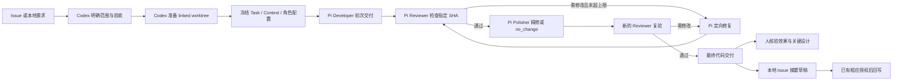

> Historical design or evidence from the 0.2 runtime and migration proposal. For the maintained runtime and validation status, see [README](../README.md) and [0.3 verification](verification-0.3.0.md).

# Meerkat 真实工作流实施与核验

日期：2026-10-02。change_id：`meerkat-live-workflow-20261002`。
实施起点：`c279cbd561046d9c3ded1fa53f5776198a4d23c2`；核验代码：`7c62c42c138333c0ebebe50432e1c99eb54a6412`。
分支：`codex/pi-developer-plugin`。本轮只形成本地提交，没有 push、merge、部署或生产变更。

本记录补充此前的[设计原型核验](verification-20261002.md)。原型记录仍描述当时的状态。

## 现在的流程

修复上限、时间和 token 预算约束整个任务。超限、错误和不明中断保留证据，由协调者判断恢复或修订任务；不会无限循环。最终代码交付不代替独立 QA、Preview 验证、发布授权、客户验收。

## 已实现

| 部分 | 实现及证据 |
|---|---|
| 执行 | Developer、Reviewer、Polisher 有不同成功合同；reviewer 不提交，polisher 可以不改代码；实际 HEAD、范围、干净状态和上下文摘要由控制器核对 |
| 调度与恢复 | 独立任务并行，默认 2、上限 4；同 worktree 串行；依赖先交付，必要 SHA 须实际进入目标仓库；停止仅操作控制器拥有的子进程；显式恢复与中断确认 |
| 持久记录 | Project、Context、Task、Run、Delivery、Review、冻结角色配置存入私有目录；worktree 删除不删除交付历史；坏状态不替换成空状态 |
| Issue | 实际 `gh` 读取、哈希及读取时间；原文是私有不可信来源；本地交付草稿；显式 apply、标记去重、未知结果重读；真实回写只做了模拟测试 |
| UI | Magpie 风格 Agents / Tasks / Usage；展示真实运行、模型、事件、上下文、交付和检查；没有看板；断连保留过期历史并显示运行数未知 |
| 桌面接线 | 同一个 UI factory 与 CSS 在 ShadowRoot 中渲染；injector 在宿主 CSP 外取状态并剥离写令牌；桌面只读，不使用 iframe；原生导航和升级清理有模拟验证 |
| 指标 | 实际角色时间与用量，缓存读写单列，未知不当零；一次通过率、修复次数、检查耗时；费用没有可信返回时保持未知 |

通用代码不含任何使用项目的业务逻辑。执行配置由用户本地持有，预算和模型需要按任务选择，不存在适合所有项目的默认值。

## 核验

- Node 22.23.2：`node --test --test-reporter=spec plugins/meerkat/tests/*.test.mjs`，**125 通过、0 失败**，约 38 秒；没有连接原生 Codex 或写入 GitHub。
- `git diff --check c279cbd..7c62c42`：通过。
- `/usr/bin/python3 quick_validate.py plugins/meerkat/skills/meerkat-flow`：通过。其他角色的历史报告使用了不同 Python，曾报告缺 PyYAML；该历史报告保留，本次验证已补足这一检查。
- Issue CLI 实际读取公开 Magpie Issue `https://github.com/yetone/magpie/issues/558`，私有快照 0600；它是接口验证来源，不是本项目任务，也没有向该 Issue 发消息。
- 本地浏览器真实 API：显示两条真实 Pi 运行，工作流 heartbeat 去重；最终任务、候选 SHA、共享上下文、检查命令与结果、Usage 已观察。浅/深主题和窄屏无横向溢出的检查已执行；最终版本没有改变布局 CSS。收尾浏览器 error/warn 为空。

### 真实 Pi 链路

任务：`823816c4-1c6f-4cb7-b599-cd049d31e9af`，完善真实工作流使用指南与协调 Skill。
需求来自本地；没有伪造 Issue 关联。该任务在一个实际工作流仓库的 linked worktree 执行，属于 Meerkat 插件开发，不是使用项目的业务交付。

Developer → Reviewer pass → Polisher `no_change` → 新 Reviewer pass → `delivered`。
最终候选：`0147054486bd0151963570d6112afae0ed3a7ce1`。此后桌面接线与显示修复是新的本地提交，不把旧候选的审查扩大为新代码的审查。

| 指标 | 真实试点 |
|---|---:|
| 角色运行 | 4 次；均使用本次选定的 Opus 配置 |
| 墙钟时间 | 812.936 秒，约 13 分 32 秒 |
| Agent 时间合计 | 812.337 秒；UI 逐次取整略有差异 |
| 输入 / 输出 | 158 / 38,377 |
| 缓存读 / 写 | 2,262,312 / 192,978 |
| 四项合计 | 2,493,825；不是账单金额 |
| 修复轮次 | 0；首次检查与复验均通过 |
| 费用 | 未知；服务商未返回可信费用 |

本地交付摘要草稿已生成，没有发送。角色的历史缺口描述只覆盖其当时实际检查的范围；这里的协调者核验补充了真实角色链路证据。

## 本轮开销与改进依据

本轮实施共有 22 次已结束 Pi 调用：10 次成功、8 次预算停止、4 次失败。已报告四项 token 小计 13,013,217：input 165,527、output 491,187、cacheRead 11,162,924、cacheWrite 1,193,579。调用耗时合计 6,601.2 秒，含并行调用，不能等同整个开发的墙钟时间。小型诊断、Codex 自身用量及部分失败/停止中的消息覆盖不全；零计数不证明零消费，费用仍未知。

这次数据不能证明“Pi 天然省 token”。早期大范围任务、反复在提交前触发预算上限和连接故障拖慢了交付。拆成具体缺陷、缩短上下文并降低 thinking 后，最后两项修复分别约 114.5 秒 / 278,356 四项 tokens 与 222.4 秒 / 224,880 四项 tokens。后续用任务时长、缓存、修复率和实际账单持续选择配置，避免仅提高预算。

执行时恢复了 ZenMux 连通性：系统解析返回的地址不可用，使用 Cloudflare DoH 解析结果的临时子进程 DNS preload 后，工具写入探针和真实调用成功。没有修改系统 DNS、API key 或 TLS 校验。该诊断配置位于本机私有目录，未写入通用插件。

完整小摘要与规范化指标保存在本机 `~/.codex-pi-developer/metrics/meerkat-live-workflow-20261002.json`；UI worktree 的忽略执行回执已另存私有归档。没有把原始对话、凭据或客户内容写入指标。

## 使用与剩余边界

使用入口是 [README](../README.md) 与 [meerkat-flow](../skills/meerkat-flow/SKILL.md)：向 Codex 给需求，Codex 准备任务并调用本地控制器，Pi 负责实施，面板显示运行与交付。

- **原生 Codex 实机核验尚未完成**：此前原生应用访问被拒绝，本轮没有绕过。桌面接线通过自有 DOM / mock CDP 检查，不能据此声称当前 Codex 版本已安装可用。这是非官方、依赖版本的适配器。
- 本地浏览器 `http://127.0.0.1:47826/` 是真实数据的开发验证界面，不代表官方插件 UI。
- 本轮未升级已安装缓存包，也未合入主目录或远端。代码保存在当前工作树与本地分支。
- 使用项目的真实业务 Issue → Pi 修改 → 项目自有验证 → 人效果核验的完整链路仍需在实际工作流中验证；本次没有冒充完成该业务链路。

