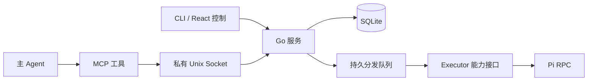

# Meerkat MCP 控制与并发设计

日期：2026-10-03（Asia/Shanghai）

change_id：`meerkat-mcp-control-20261003`

基线：`9d00ab376061bcd30fa73e3c7482ec94f2d1efe2`。本文件补充会话与预算重构设计。

状态：完整目标设计。运行查询、停止、未来运行设置和持久异步分发/查询/有限等待已接入 MCP；会话消息、暂停恢复和预算控制尚未接入。

## 1. 参考与取舍

| 对照 | 已核对的能力 | Meerkat 采用的设计 |
| --- | --- | --- |
| [Superset MCP](https://docs.superset.sh/mcp-server) | 任务、工作区、Agent 启动、终端等控制工具 | 主 Agent 使用结构化工具调用本地服务；各入口复用同一状态和校验 |
| [Goose Summon](https://goose-docs.ai/docs/mcp/summon-mcp/) | 内置扩展采用与 MCP 扩展相同的工具交互；异步委派返回任务 ID，后续等待结果 | 分发立即返回持久句柄；查询或等待与执行分开 |
| [LangGraph interrupts](https://docs.langchain.com/oss/python/langgraph/interrupts) | 持久检查点、按线程恢复；恢复会重跑节点开始部分 | 暂停保留进度；每个副作用单独记录确认状态，未知操作禁止重放 |
| [MCP tools](https://modelcontextprotocol.io/specification/2025-11-25/server/tools) | 输入输出合同、工具错误和行为提示 | 严格输入校验、结构化回执、如实标注读写；提示不代替授权 |
| [MCP Tasks](https://modelcontextprotocol.io/specification/2025-11-25/basic/utilities/tasks) | 实验性长任务句柄、查询与取消 | 能力协商后再适配；基本控制工具独立可用 |

这些是文档和接口对照，不代表已运行或完整审计第三方项目。Superset 的云端组织授权不直接照搬到本地私有服务。Goose 的内置扩展也不能直接称作一个外部 MCP 服务。

## 2. 组件与身份

MCP 连接、JSON-RPC 请求、持久操作和编码任务分别具有身份：

- `requestId`：控制请求去重键，与 MCP 协议的请求 `id` 分开。
- `operationId`：长操作句柄，包括一次分发或恢复请求。
- `taskId`：冻结的工作单元。
- `runId`：一次有预算的执行。
- `sessionId`：执行历史与续跑会话。

Go 服务拥有任务和执行进程。关闭 MCP、CLI 或面板连接不结束任务；工具超时不自动重试写入。用户明确停止与客户端取消等待分别处理。

## 3. 完整控制合同

| 类别 | 目标工具 | 约束 |
| --- | --- | --- |
| 展示 | `open_monitor`、`get_monitor_snapshot` | 保留现有 UI 合同，面板数据无写令牌 |
| 查询 | `list_runs`、`get_run`、`get_settings` | 默认摘要、过滤、分页；详细证据按需读，未知值保留 |
| 准备 | `validate_task`、`prepare_task` | 主 Agent 准备 Worktree；冻结目标、范围、验收、Context、Profiles 与预算 |
| 分发 | `dispatch_tasks`、`get_operation`、`wait_operation` | 先持久化再返回句柄；重复请求同参返回原操作，异参拒绝 |
| 会话 | `send_message`、`pause_task`、`resume_task` | 校验目标 Run/Session、期望版本、执行器能力和检查点；接受与应用分开 |
| 停止 | `stop_run`、未来 `get_control_receipt` | 稳定请求 ID；接受与实际结果分开；身份未知保留未知 |
| 设置 | `update_settings` | 未来运行参数；已有任务预算和合同不被改写 |
| 预算 | `propose_budget`、`apply_budget_decision` | 总额、阶段预留、用量与授权依据分开记录 |
| Issue | `read_issue`、`draft_issue_update`、`apply_issue_update` | 读取来源、生成草稿、显式发送；沿用实际远端授权和去重 |

只有已实现并验证的工具进入 `tools/list`。不同执行器的实时引导、结束后恢复、压缩与停止能力分别声明。Pi RPC 通信模块已存在，调度器尚未切换；不能据此开放真实会话控制。

所有写入在 Go 校验项目范围、冻结合同、资源占用、预算和授权依据。MCP `readOnlyHint`、`idempotentHint` 和界面可见性都是行为提示；本地进程身份、服务权限和实际操作校验才构成边界。主 Agent 的工具调用依据用户授权，不把文件或任务内容当作新增授权。

## 4. 并发、恢复与成本

Core 已改为一个 Go 调度循环和 SQLite 持久队列，各分发共用全局并发上限、Task 占用、Worktree 排他和依赖版本校验。兼容 `execute` 保留旧等待入口的忙碌语义，新异步入口支持独立请求。Session 占用、项目/Provider 配额和重试等待继续按完整设计实施。

MCP 只提交操作，不启动另一个调度器。长操作不占用协议处理循环，短查询与停止可以及时回应。先落库再确认接受；崩溃后核对租约、进程身份、文件和不确定副作用。不能确认已发生的模型请求、Git 操作或外部写入时，不自动重发。

事件按持久序号增量获取，游标包含所属操作；截断明确标记并退回快照。等待具有上限和超时语义。主 Agent 默认收到角色、状态、近期活动、已知用量和交付摘要，不接收全部提示词与工具日志。每次轮询、重复读取和压缩的用量纳入指标。

任务预算不足时先收尾、保存检查点并暂停。授权总额内的阶段调配由 Go 完成；扩大总额记录新的预算决策。MCP Tasks 协议的取消回执也不单独作为 Pi 进程已停止的证明。

## 5. 第一阶段实施合同

目标：让主 Agent 查询运行、提出可对账的停止请求、读取并调整已有未来运行设置。

范围：`internal/mcp/**`、`internal/core/core.go` 的设置事务序列化、相应检查及本设计文件。直接本地编码，无子 Agent、模型 Profile 或付费模型请求。使用独立 linked Worktree，不修改用户运行服务、配置、插件安装或主线程工作区。

本轮工具：

- `list_runs`：按 Task 和状态过滤，最多 100 条，快照分页，明确变化时重新查询。
- `get_run`：一个运行的角色、执行器、模型、状态、近期结构化活动及已知 token 用量。
- `get_settings`：并发数、修复轮次和更新时间。
- `stop_run`：必填 `runId`、稳定 `requestId`；复用 Go/SQLite 回执。结果未知时给出原身份用于核对，不自动重放。
- `update_settings`：只接受 `maxConcurrency`（1..4）和 `maxFixRounds`（0..2），至少一项；超时返回未知，查询实际设置后再决定。

额外修复：Go 设置的读取、合并、写入使用同一锁，防止 MCP、HTTP 和 CLI 并发修改不同字段时丢失更新。

本轮不开放任务分发、会话消息和预算扩额工具。Codex MCP App 仍为只读监控；新增控制工具仅标为模型可见，面板写入与真实宿主仍需后续验收。

必验：严格参数、边界值、正确读写提示、无写令牌/私有进程信息、未知用量、停止接受与结果区分、重复停止去重/冲突、丢失回执不重放、设置并发保留字段、真实私有 Unix Socket 接入、MCP 退出不关闭服务。

交付状态：本轮代码与隔离联调已通过，作为独立本地提交交付；未集成、安装或发布。

验证记录：

- `go test -race ./internal/mcp ./internal/core ./internal/server ./internal/executor/... -count=1` 通过。
- `go vet ./internal/mcp ./internal/core ./internal/server` 通过。
- 真实临时 Go 服务与私有 Unix Socket 接入测试通过；停止回执保存在 SQLite，同请求去重，跨 Run 复用请求 ID 被拒绝；MCP EOF 后服务仍可响应。
- 参数类型、空值、额外与重复字段、大小写不匹配、边界值、分页变化、私有字段、未知用量、丢失回执和内部错误保持未知的检查通过。
- 首次整组回归的已有 `TestFrozenHeadExplicitDependencyProgression` 出现一次 `report_stale`。本分支和源码基线分别单独运行三次均通过，整组复跑也通过；偶发原因尚未确认，未修改该交付校验。
- 没有启动真实编码 Agent 或付费模型请求，未验证真实 Codex 工具调用、面板控制、预算暂停或会话续跑。

## 6. 第二阶段：持久异步分发

`dispatch_tasks`、`get_operation`、`wait_operation` 已接入同一私有 Socket 和 Go 调度器。提交先持久化 Operation 与任务占用，返回 ID；客户端断开不停止任务。丢失首个回执可使用 requestId 查询；异参拒绝，绝不自动重放。MCP 等待限制为 0..1000 ms，CLI 为 0..30000 ms。MCP Tasks 实验协议仍不宣告支持。

已开始而未结算的操作在重启时标为未知；从未开始的操作核对合同后恢复。面板仍为只读。完整合同及验证见 [异步分发](async-dispatch-20261003.md)。
