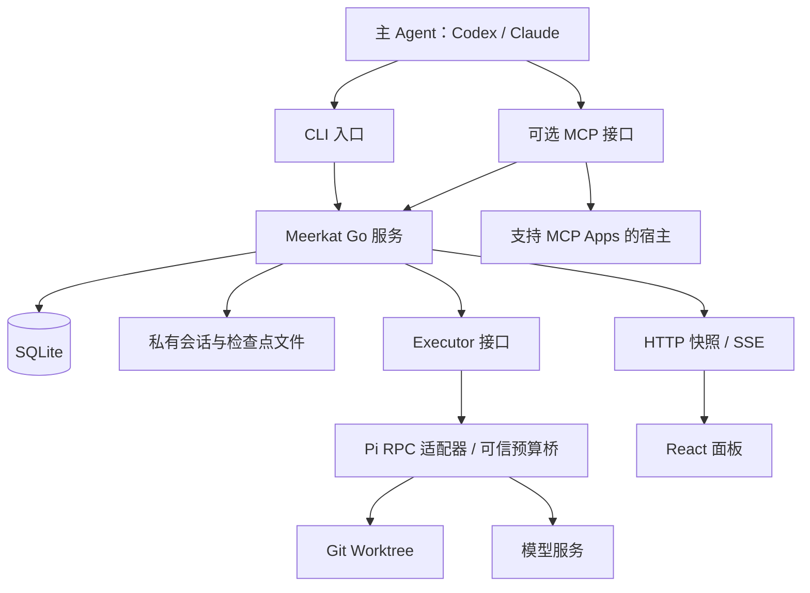

# Meerkat 完整重构：会话、预算与 Agent 协作

日期：2026-10-03（Asia/Shanghai）

change_id：`meerkat-session-budget-coordination-20261003`

源码基线：`fd7575076a34fbdbff8f4766002d5826489d605b`

状态：完整目标设计；私有 Pi RPC、MCP 运行查询/停止/设置、持久异步分发、持久执行会话及请求预算授权/结算已在独立开发分支实现。Go 调度器使用 Pi RPC 执行有会话绑定的 Run，开发/修复复用历史，每次审查保持独立。自动收尾、脏工作区检查点恢复和完整会话控制尚未实现；未替换已安装版本或用户服务。MCP 的完整控制合同见 [补充设计](mcp-control-20261003.md)。

## 1. 目标与职责

Meerkat 是产品名。架构组件分别命名为 Meerkat Go 服务、CLI、React 面板、MCP 接口和 Executor 适配器，避免把产品与某个服务或模型混用。

主 Agent 整理需求、设计、任务和验收；执行 Agent 完成有界工作；Go 服务管理调度、预算、会话和恢复。一次执行暂停后，任务保留进度；交付由 Git 状态和检查证据决定。

| 组件 | 职责 |
| --- | --- |
| 主 Agent | 需求、调研、关键设计、拆分、协调、处理分歧、最终判断 |
| Go 服务 | 调度、状态机、预算、消息、进程生命周期、检查点和恢复 |
| SQLite | 任务、会话、控制回执、预算、用量和交付历史的权威 |
| 私有文件 | 会话内容、检查点文件和检查证据；SQLite 保存引用与摘要 |
| Executor | 通用操作到具体 Agent 协议的转换；当前实际支持 Pi |
| Pi | 模型调用、工具使用、代码实现和检查 |
| React | Agents / Tasks / Usage，消费版本化快照与 SSE |
| CLI / HTTP | 独立使用和程序调用入口 |
| MCP | 可选宿主接入层，提供工具和面板资源 |

Node 只承担前端工具、执行器 CLI 和薄协议桥接。所有调度和预算策略留在 Go。

MCP 不是核心运行前提。CLI、浏览器和 MCP 共用 Go 服务的操作，不能各自拥有调度器或直接写数据库。MCP 的停止与设置操作复用现有 Go 校验和 SQLite 状态；异步分发、查询与有限等待已接入同一 Go 服务；会话和预算控制按补充设计继续实施。MCP App 仍提供只读监控。真实宿主展示需要单独验收，浏览器截图不能替代。

## 2. 概念与合同

| 概念 | 定义 |
| --- | --- |
| Project | 一个仓库及私有工作配置；项目上下文、凭据引用和权限分别管理 |
| Change | 一次需求对应的一组任务，沿用 `change_id` 关联 |
| Task | 冻结目标、范围、验收、Context、Profiles、依赖、基准版本和预算 |
| Agent | 被分配任务并承担角色的工作实例 |
| Role | 开发、审查、修复、精修等职责，独立于 Agent 身份 |
| Profile | 冻结的执行器、模型、工具能力、指令和限制 |
| Session | 可持续使用、可核对的执行历史 |
| Run | Session 中的一段受预算和时间约束的执行 |
| Checkpoint | 阶段进度、文件状态、合同、会话和用量的可核对记录 |
| Delivery | 经检查、对应确定 Git SHA 的代码结果 |
| Review | 对特定 SHA 与任务合同的审查结论 |

开发任务可以有多个 Run。修复可延续开发 Session，审查使用独立上下文。更换模型或冻结合同需要显式产生新配置与执行分支，不静默改写原历史。

任务状态拆为执行状态、工作阶段、交付状态，保持对应事件和回执：

- 执行：排队、运行、收尾、暂停、结束、异常、身份未知。
- 阶段：开发、审查、修复、精修、复审。
- 交付：尚无候选、候选待检查、检查通过、最终本地交付。

## 3. 完整交付流程

需求与可选 Issue → 主 Agent 整理设计 → 冻结合同与预算 → 准备干净 linked Worktree → 分发开发 → 范围核对与必要检查 → 候选提交 → 独立审查 → 有限修复 → 按需要精修 → 变更后复审 → 最终本地交付。

主 Agent 准备 Worktree，Go 服务校验并取得占用。相同 Worktree 写入排他；不同 Worktree 的独立任务可以并行。下游任务必须得到实际可使用的依赖版本，不能仅凭上游状态启动。审查绑定候选 SHA；SHA 变化使原审查结论失效。精修未修改 SHA 时复用仍有效的审查。

记录交付 SHA、检查、已知缺口和用量。本地交付、QA、人核验、仓库集成、Preview 和部署分别记录。远端 Issue 写入、push、merge 和部署仍依据用户的实际授权。

## 4. 预算策略

### 4.1 分开统计

上下文占用、累计 token、费用、请求次数、时间、修复次数分别管理。上下文压缩减少后续上下文负担，已经消耗的资源仍计入任务预算。

授权总额按 Change / Task / Run 关联；父子预算使用同一账本，不重复计费。开发、收尾、审查、修复和必要精修有阶段预留。初始预留明确标为保守配置，后续用实际分布校准。

### 4.2 请求前授权

Go 原子预留请求预算，覆盖在途并发、最大输出、重试、上下文压缩和执行器内部模型调用。请求结束按实际用量结算。缺失结算的请求保留占用和未知标记。

Pi RPC 本身不提供严格费用门禁。固定版本的可信 provider / SDK 桥接层必须在付费请求发送前向 Go 申请授权。桥接层执行协议，Go 决定策略。执行器能力声明必须区分双向控制、会话保存、恢复、压缩、用量和请求门禁。

只有可靠的计价上界与实际请求门禁通过验证时，才支持严格费用预算。价格或用量不可靠时，费用保持未知或明确为估算，以 token、请求次数和时间限制运行。不得把 Pi 的估算价格当作实际账单。货币使用明确币种与精度，记录价格来源、生效时间和缓存语义。

### 4.3 收尾与暂停

预计剩余预算不足以完成后续工作与收尾时，通知执行 Agent 停止扩大范围，完成可以安全结束的操作并记录进度。满足条件时生成候选提交；不足时保存未提交修改的检查点。

硬边界阻止新的超预算请求，在请求之间完成核对与暂停。用户停止、严重异常和期限超限允许强制结束。调度器可以在授权总额内调整阶段分配和并发；扩大总授权额需要新的预算决策。

## 5. 会话、检查点与恢复

检查点包含任务合同摘要、Profile 摘要、Session 引用、基准和当前 SHA、分支、Worktree、修改与未跟踪文件清单及摘要、已完成与剩余事项、检查证据、在途或结果未知的工具操作、用量和最后确认事件序号。

文件先写入私有临时文件并原子替换，再提交数据库引用；崩溃恢复核对两者。Git、文件和 SQLite 不属于同一个原子事务，必须记录中间状态并对账。

恢复前核对合同、身份、租约、文件、Git、工具操作、预算与权限。与检查点一致的未提交修改允许继续；额外修改、身份未知和外部操作结果未知时升级主 Agent，禁止自动重放。

进程身份采用 owned process、主机、启动身份、随机握手和租约等证据；旧 PID 单独不能证明身份。停止的已接受、执行中、已确认和未知结果分别保留。清空 Pi 后续消息队列后再中止，避免排队消息重新激活执行。

会话和证据存于私有目录。公开快照、MCP、界面和默认导出不包含原始会话、凭据、写令牌或私有会话路径。

## 6. 协作、Issue 与界面

共享冻结的需求、设计、接口、验收、依赖和决策；各 Agent 保留自己的执行历史并获得任务所需的上下文。主 Agent 接收结构化摘要，有需要时再读取详细证据。Agent 可提出拆分建议，由协调层生成有范围、依赖与预算的任务。

多项目可并行，项目权限和上下文分别管理。限制项目、模型服务和整体并发。每个 Session 同时只有一个执行段；等待限流与决策的时间单独计量。

Issue 保存需求、验收、决策、阻塞、交付摘要和可复用经验。SQLite 保存实时执行与恢复状态；工具日志不逐条发送到 Issue。外部更新先生成草稿，明确 `--apply`、授权与回执去重。

| 界面 | 内容 |
| --- | --- |
| Agents | 活跃数量、任务、角色、执行器、模型、阶段、最近活动和暂停原因 |
| Tasks | 目标、Issue、依赖、候选 SHA、检查、剩余工作、交付和恢复条件 |
| Usage | 已确认 token、未结算请求、费用来源、剩余预算、排队与执行时间、修复次数 |

详细证据放在详情中。上下文占用和累计预算分别显示；指令接受与实际完成分别显示；断连后完整快照恢复，明确标注过期或未知状态。当前宿主监控保持只读；写入能力按核心接口和宿主权限单独验收。

## 7. 完整落地清单

| 编号 | 工作包 | 状态 |
| --- | --- | --- |
| 01 | 统一概念、冻结合同与三个状态维度 | 待实施 |
| 02 | Executor 能力声明与会话接口 | 能力声明、私有会话初始化/核验、Run 绑定及受支持 Pi HTTP 请求门禁已实现 |
| 03 | 私有 Pi RPC 通信、回执、事件与停止顺序 | 通信基础层与有会话 Run 的 RPC 执行通道已实现并验证 |
| 04 | 持久 Session、角色续跑与任务绑定 | 开发/修复复用、独立审查和冻结合同绑定已实现；预算暂停后的脏工作区续跑待检查点 |
| 05 | 可信请求门禁和计价能力验证 | Pi 0.99.1 文本 HTTP SSE 门禁已验证；输入采用估算预留，费用保持未知，精确计价/上界待实施 |
| 06 | 分层预算、阶段预留、预授权与结算 | Task/Run 共同额度、请求预留/一次性发送/原始用量结算已实现；阶段预留与额外预算决策待实施 |
| 07 | 软收尾、暂停与未交付进度 | 待实施 |
| 08 | 检查点、恢复核对与不确定操作处理 | 待实施 |
| 09 | 进程身份、租约、停止与重启恢复 | 会话占用与 Run 原子记录、私有 RPC 停止/回收、重启标未知已实现；未知会话人工核对与恢复控制待实施 |
| 10 | 持久控制消息、回执和去重 | 待实施 |
| 11 | 依赖版本、跨 Worktree 并发、限流和重试等待 | 持久全局队列、Worktree 排他与依赖验证已实现；项目/Provider 限流与重试等待待实施 |
| 12 | 独立审查、有限修复、条件精修与 SHA 结论绑定 | 扩展现有实现 |
| 13 | SQLite 会话、检查点、预算账本与请求用量迁移 | V3 Operation/成员、V4 Session/Run 与 V5 请求预算账本迁移已实现；检查点待实施 |
| 14 | 版本化快照、TS 类型、校验和 SSE 恢复 | 扩展现有实现 |
| 15 | Agents / Tasks / Usage 暂停、恢复、证据与用量展示 | 待实施 |
| 16 | Issue 来源、草稿、交付摘要和经验留存 | 扩展现有实现 |
| 17 | delegate / workflow skill 的收尾与恢复说明 | 待实施 |
| 18 | 历史迁移、备份恢复与脱敏导出 | 队列、回执、空闲/未知会话及请求账本的备份恢复已验证；活动会话备份拒绝，检查点待实施 |
| 19 | doctor 的协议版本、会话、门禁与配置验证 | 待实施 |
| 20 | CLI / HTTP / 可选 MCP 控制、安装包和真实宿主验收 | CLI/MCP 查询、停止、设置、异步分发与有限等待已实现；完整控制、安装和宿主验收待实施 |

实施顺序：合同与接口 → 持久会话与控制 → 预算与自动收尾 → 检查点与恢复 → 协作与完整交付 → Issue、界面、skill、迁移与安装验证。全部工作包完成后才按完整重构交付。

## 8. 验收与指标

必验：正常交付、退回与有限修复、精修无变化与变更复审；预算收尾与真实续跑；服务重启、PID 复用、身份未知、文件不符和不确定工具操作；重复请求和丢失回执；并发预留、未知用量、缺失价格、重试与压缩计费；Worktree 排他、真实依赖、循环和修复上限；幂等迁移、冲突、备份保留新历史；断连恢复、只读监控、真实安装与宿主展示。

必须演练真实 Pi 的任务执行、预算暂停、同一任务恢复和最终提交。只运行 RPC 元数据查询不能证明这些能力已完成。

指标关联 Change / Project / Task / Agent / Session / Run / Role / Executor / Model。记录首次通过率、续跑成功率、人工接管原因、有效交付 token 与费用、压缩与重复读取开销、排队/执行/检查/决策等待、修复次数和未知用量比例。墙钟时间与并发 Agent 时间分别报告；未知保持空值。

## 9. RPC 基础层实施合同（首项历史记录）

目标：交付可由 Go 进程管理层调用的私有 RPC 客户端，验证 Pi 0.99.1 的本机协议兼容性。

范围：`internal/executor/pirpc/**` 与本设计文件。实现采用直接本地编码和测试；不创建编码子 Agent，不使用模型 Profile，不运行付费模型请求。

验收：命令 ID 对账与乱序回执；接受与完成区分；JSONL 的 LF/CRLF 与 Unicode 正确处理；取消后的已发送命令保持未知、无自动重放；消息/工具/错误内容不进入公开事件；缺失用量不填零；清队列、中止和状态核对；关闭输入后读完退出事件；安装版本元数据探测。

该首项交付的 RPC 模块不启动进程、调度任务、执行预算策略、保存检查点或开放公共控制接口。当时执行通道保持原 `Executor.Execute` 行为；后续 Go Executor / 调度器集成记录见第 13 节。

本次验证记录：

- `go test -race ./internal/executor/... -count=1` 通过，包含原适配器回归和新 RPC 客户端检查。
- 设置 `MEERKAT_TEST_PI_RPC_BINARY` 后，本机 Pi 0.99.1 的状态查询、清队列、中止、优雅关闭与进程退出检查通过。
- 元数据探测使用临时目录、禁用工具与资源发现、离线启动，并且不发送任务提示词或传入模型凭据。
- `go vet ./internal/executor/...` 通过。
- 首次真实探测发现同时关闭输入输出会截断退出过程，已实现先关闭输入、读取剩余事件的 `Shutdown`，并补充退出事件与截止时间测试。
- 当前改动为独立本地交付；未验证真实编码任务的预算暂停、会话续跑或 Codex UI，也未据此宣称完整重构已完成。

## 10. 参考依据

- [Codex 子 Agent](https://learn.chatgpt.com/docs/agent-configuration/subagents)：主线程协调、独立任务上下文与结果汇总。
- [Claude Code 子 Agent](https://code.claude.com/docs/en/sub-agents)：独立上下文和可恢复会话；具体能力按产品与 Agent 类型核对。
- [Claude Agent Teams](https://code.claude.com/docs/en/agent-teams)：共享任务与消息，以及协调和成本开销。
- [OpenAI 请求预算示例](https://developers.openai.com/cookbook/articles/per_run_spending_controller_responses_api)：预留、结算与并发账本；不作为 Codex 内部机制的证明。
- [Claude Managed Agents 预算](https://platform.claude.com/docs/en/managed-agents/budgets)：请求边界控制和保留会话的预算暂停。
- [Pi RPC](https://github.com/earendil-works/pi/blob/main/packages/coding-agent/docs/rpc.md) 与 [命令](https://github.com/earendil-works/pi/blob/main/packages/coding-agent/docs/rpc-commands.md)：本机 JSONL、回执、事件、引导与清队列中止；同时以安装版本接口为准。
- [OpenAI MCP UI 接入](https://developers.openai.com/plugins/build/chatgpt-ui)：工具关联 UI 资源与数据交换；具体宿主的入口与渲染仍单独核验。

## 11. MCP 控制实施

基线已更新到 `9d00ab376061bcd30fa73e3c7482ec94f2d1efe2`，独立工作区保留 RPC 基础层。完整调研依据、控制工具、并发规则与本轮合同见 [MCP 控制设计](mcp-control-20261003.md)。当前公开工具只包含已经接到服务权威的操作，包括持久异步分发；预算暂停与会话控制工具继续保留为待实施。

## 12. 持久异步分发实施

实施合同与验证记录见 [异步分发](async-dispatch-20261003.md)，使用见 [操作说明](../docs/async-dispatch.md)。本轮队列属于工作包 11、13、18、20 的一部分，不替代整个设计。

## 13. 持久执行会话实施

实施合同与验证记录见 [持久执行会话](persistent-sessions-20261003.md)，使用与边界见 [会话说明](../docs/persistent-sessions.md)。本项实现工作包 02、03、04、09、13、18 的会话部分，不开放未验证的控制能力。下一项是请求前预算授权与账本结算，随后是阶段预留、软收尾和检查点恢复；这些完成后才可验证 token 临界时保留进度并继续交付。

## 请求预算实施记录

实施合同与验证记录见 [请求预算](request-budget-20261003.md)，使用范围见 [预算说明](../docs/request-budgets.md)。工作包 05、06、13、18 的请求部分已在独立分支实现，并由真实安装 Pi 与隔离本地假模型验证。阶段预留、提前收尾、检查点和未提交进度续跑仍是下一阶段；完整设计的其他工作包继续保留。
